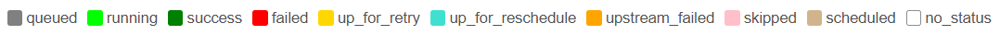

在airflow中，可以通过对pipeline中的不同task赋予不同的状态(state)说明当前任务的执行进度。通过airflow的状态机制，可以对当前的任务执行进度和状态进行很好的把控，及时了解指定任务的情况。

其中，airflow在更新到2.0版本后，相较于之前的1.9.0版本，airflow对任务状态进行了进一步的细化说明。本文主要是为了对airflow的基础状态信息进行一个简单的介绍和记录。

# 1. airflow状态说明

## 1.1 通过颜色区分
airflow中的状态标识蕾丝红绿灯的状态区分，主要分成了红、黄、绿三种基础状态。在此基础上，针对三种不同的颜色范围，进行了进一步的细化标识来表明不同的细化状态。

## 1.2 通过粒度区分
除此之外，airflow状态还会根据标明级别，分成了dag状态和task状态两大类，不同类别的状态主要有如下几个小类：
1. Dagrun：SUCCESS, RUNNING, FAILED
2. Task：SUCCESS, RUNNING, FAILED, UPSTREAM_FAILED, SKIPPED, UP_FOR_RETRY, UP_FOR_RESCHEDULE, QUEUED, NONE, SCHEDULED

其中，Task状态主要是针对Dagrun状态的细化说明，因为Dag中不同task因为执行时间、顺序和依赖的不同，会有不同的状态表现。

## 1.3 通过状态范围区分
同时，可以通过是否会继续进行状态变更，分成完成（finished）和未完成（unfinished）两大类。
* 完成状态代表airflow scheduler不会对当前task/dagrun进行监控。
* 未完成状态代表当前task/dagrun的状态还会发生变更，最终会达到一个完成状态。