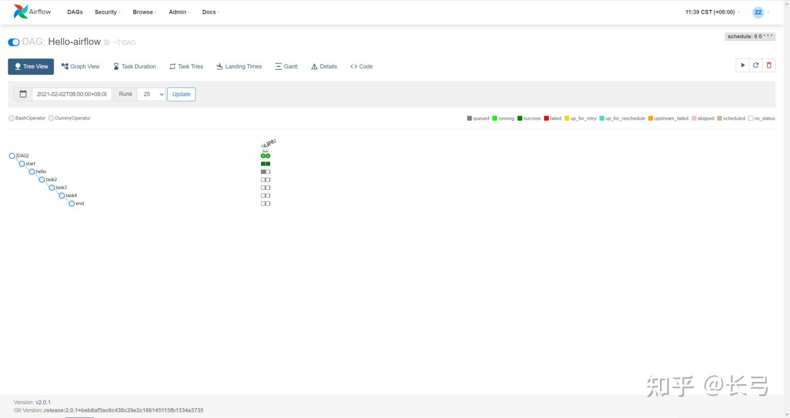
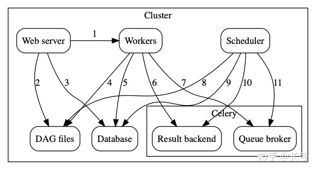

> airflow是airbnb开源的一套可以灵活管理工作流的自动化和调度系统
<!--more-->


## 简介
#### 基本功能
airflow是一个apache孵化的开源的基于有向无环图调度和监控平台。具有以下的优点
1. 灵活易用。工作流定义通过python编写，容易定制化，而且代码可读性较高
2. 支持任务丰富。通过Operator支持常见的任务类型，类似shell，python，ssh···
3. 方便拓展。支持热式扩展执行节点。通过Celery可以部署多个worker，几乎可以做到无限扩展。
    1. 分布式部署worker的时候运行工作流上的每个task在不同的worker上执行
4. task粒度的操作：
    1. 工作流上的每个task都是可以独立重试的。一个工作流的某个task失败不需要从头开始

#### 主要组成部分


1. 界面展示和监控（webserver）
    1. 进行web段的dag/task，log等信息的展示
2. 执行器（worker）
    1. 执行具体的任务（task）
    2. 主要分成SequentiaExecutor, LocalExecutor, CeleryExecutor三种
3. 调度器（scheduler）
    1. 任务调度器，根据dags生成要执行的任务，并控制任务队列（类似crontab）
    2. 使用CeleryExecutor的时候也负责提交消息到中间件队列（redis或rabbitMq）
4. 数据库（database）
    1. 存储任务、dags、变量、连接等信息
5. celery
    1. 分布式队列控制器
    2. 主要由Broker（代理）和Result Backend（结果后端）构成
        1. Broker 负责存储执行的命令
        2. Result Backend存储完成执行命令的状态信息

#### 各组件之间的通信逻辑
> 数字和上图一一对应

|服务|链接服务|说明|
|--|--|--|
|Web server|Workers|获取任务执行的日志信息|
|Webserver|DAG file|从dags文件夹的dag配置文件中读取dag结构并展示|
|Webserver|Database|获取任务状态信息|
|Workers|DAG files|执行任务|
|Workers|Database|读取和写入connections、Xcoms等信息|
|Workers|Celery's Result backend|存储任务执行信息，任务状态等|
|Workers|Celery's Queue broker|存储执行的命令|
|Scheduler|DAG files|存储DAG的结构和任务调度时间等，并控制任务执行|
|Scheduler|Database|存储DAG运行的信息和相关任务|
|Scheduler|Celery's Result backend|获取已经执行的的任务信息，状态|
|Scheduler|Celery's Queue broker|发送任务执行命令到Celery's broker|


## 本地docker部署
```dockerfile
FROM ubuntu:latest  # 拉取基础镜像
MAINTAINER *** "***@foxmail.com"

RUN apt-get update  # 更新软件源
RUN apt-get -y install python   # 安装python
RUN ln -fs /usr/bin/python3 /usr/bin/python   # 更新python对应的软连接到python3
RUN apt-get -y install python3-pip    # 安装pip
RUN /usr/bin/pip3 install --upgrade pip   # 更行pip到最新版本，防止后续安装过程中出现问题

RUN export AIRFLOW_HOME=/home/darren/airflow
RUN export SLUGIFY_USES_TEXT_UNIDECODE=yes
RUN /usr/local/bin/pip3 install apache-airflow  # 安装airflow

EXPOSE 8080   # 暴漏指定端口

CMD ['airflow db init']
CMD ['airflow users create --username admin --password admin --firstname ** --lastname ** --role Admin --email ****@foxmail.com']
CMD ['airflow webserver -D -p 8080']
CMD ['airflow scheduler -D']
```

## airflow的dag例子
```python
import random

from airflow import DAG
from airflow.operators.dummy import DummyOperator
from airflow.operators.python import BranchPythonOperator
from airflow.utils.dates import days_ago

args = {
    'owner': 'airflow',
}

dag = DAG(
    dag_id='example_branch_operator',	# dag名字，即显示在airflow上的名字
    default_args=args,					# 默认参数
    start_date=days_ago(2),
    schedule_interval="@daily",			# 调度循环时间
    tags=['example', 'example2'],		# 当前dag的tag，方便查询标注
)

# 初始化的operator, dag的开头
run_this_first = DummyOperator(
    task_id='run_this_first',
    dag=dag,
)

# 候选的分支大operator的task_id
options = ['branch_a', 'branch_b', 'branch_c', 'branch_d']

# 创建分支operator, python callable的结果返回要执行的task_id，可以是自定义函数
branching = BranchPythonOperator(
    task_id='branching',
    python_callable=lambda: random.choice(options),
    dag=dag,
)
run_this_first >> branching

join = DummyOperator(
    task_id='join',
    trigger_rule='none_failed_or_skipped',
    dag=dag,
)

# 针对不同的分支情况创建不同的任务
for option in options:
    t = DummyOperator(
        task_id=option,
        dag=dag,
    )

    dummy_follow = DummyOperator(
        task_id='follow_' + option,
        dag=dag,
    )

    branching >> t >> dummy_follow >> join
```


## airflow使用过程的注意事项

#### 时区问题
* 为了防止不同集群内部时区的差异，airflow全局统一使用UTC时间。
* 2.0中可以通过配置实现指定时区

#### execute date
* execute date 并不是当前任务的执行时间，而是airflow前一个运行周期的运行时间
* 例如：dag1每天11:00开始运行，那么在 ​2021-04-01 11:00​ 启动的任务对应的execute_date应该是 ​2021-03-31 11:00​