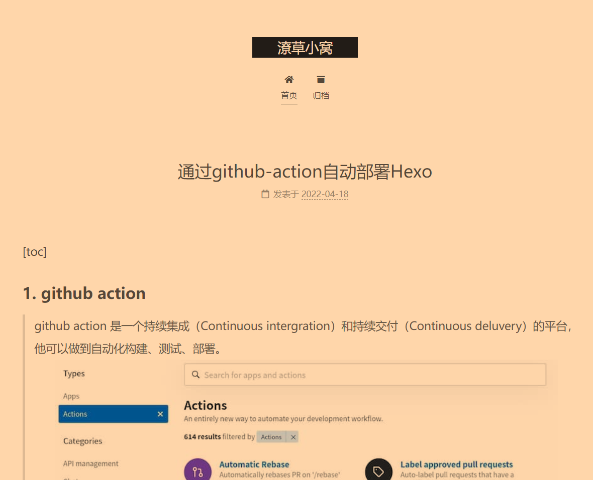

## 1. github action
> github action 是一个持续集成（Continuous intergration）和持续交付（Continuous deluvery）的平台，他可以做到自动化构建、测试、部署。

<!--more-->
我们可以通过github action的逻辑自动化部署位于git-pages上的个人博客，省去频繁的个人同步的操作。
而且针对其他难以在个人电脑上进行编译的庞大宫成，也可以历史github action提供的runner进行编译。
接下来的内容是我通过github action进行自动化部署hexo个人blog的经验。

## 2. 依赖准备
针对hexo，我们需要提供必要的md文件，剩余的内容可以通过hexo进行自动生成和部署，具体需要部署的内容是经过了`hexo generate`之后生成`public`文件夹。
将生成完成的`public`文件夹同步到名为`${user-name}.github.io`github工程的master分支后，github会自动将该内容发布到`http://${user-name}.github.io`的网页上，方便进行查看。

### 2.1 仓库准备
因此，我们至少需要准备两个仓库（或者分支）。
1. 存储`public`文件夹
   1. 使用`${user-name}.github.io`仓库的`master`分支
2. 存储md文件源代码
   1. 可以使用任务仓库的任意分支
   2. 我这里使用的是`${user-name}.github.io`的`source-files`分支